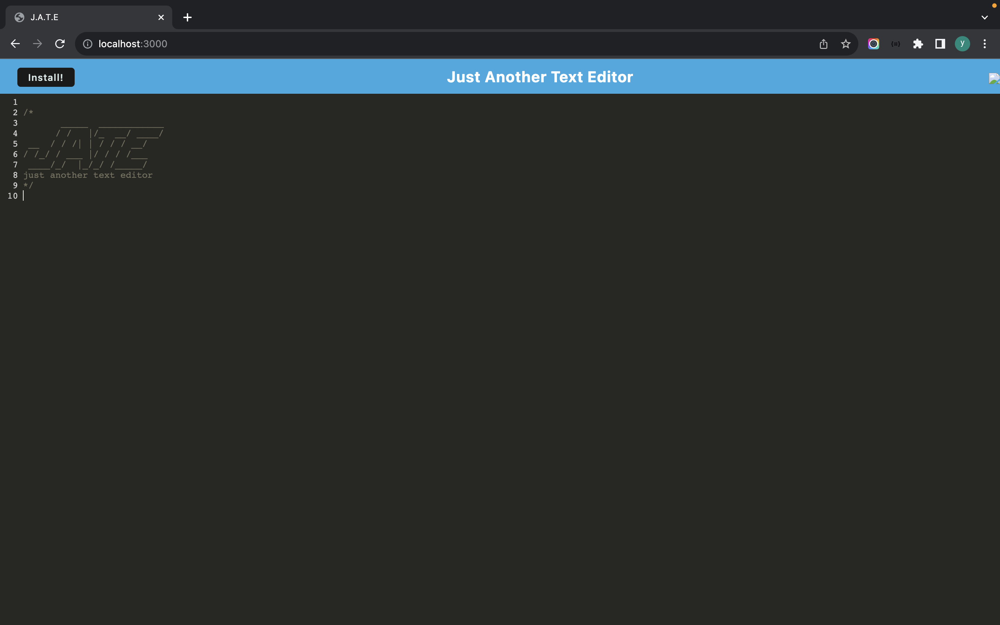

# PWA-textEditor

'Just Another Text Editor' (abbreviated as J.A.T.E.) is a progressive web app (PWA) designed as a single-page application, which also allows for easy installation and offline functionality. This was achieved by integrating IndexedDB, webpack.js, and CodeMirror. User input is managed through Local Storage and IndexedDB. Additionally, a service worker and manifest were implemented to facilitate asset caching, enabling the application to function in an offline environment.

## Screenshot 

## Usage

-Enter/delete text in the editor. Text in the editor will be saved and stay on the page even when reloaded, when the window is not in focus.

-To install the application, click the install button in the upper left corner of the page. Follow the browser's prompts to install on your local machine.

## Resources

- IndexedDB API
-Code Mirror
-Webpack